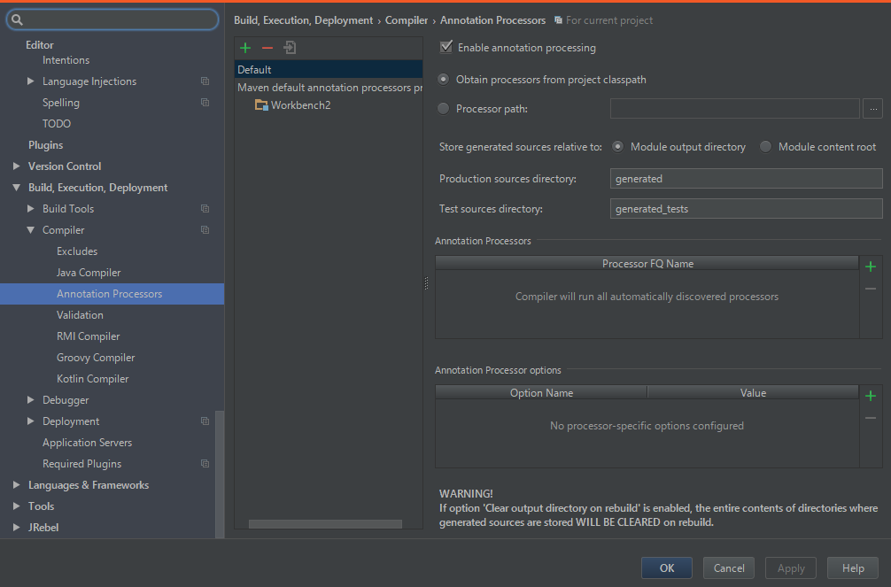

# GitThrow
GitサーバーのホストやCIするためのWebアプリです

  

## 機能  
- Gitサーバー
- プロジェクトのタスク管理
- プルリクエスト
- プロジェクトのビルド
- プロジェクトのテスト
- 成果物の管理

## 使い方  
### とりあえず試したい場合  
1. `java -jar GitThrow.jar`を実行
1. http://localhost:8080/にアクセス
1. 管理者アカウントでログイン(id: admin, pw: password)

### きちんと使いたい場合(Ubuntu)
1. `/var/gitthrow/gitthrow.jar`に配置
1. シンボリックリンクを作成
    `sudo ln -s /var/gitthrow/gitthrow.jar /etc/init.d/gitthrow`
1. /var/gitthrow/config/application.propertiesを作成
    ``` properties
    #ポート番号
    application.port=8000
    #MySQLのjdbc-url
    spring.datasource.url=jdbc:mysql://localhost:3306/gitthrow
    #ユーザー名
    spring.datasource.username=gitthrow
    #パスワード
    spring.datasource.password=password
    spring.datasource.driver-class-name=com.mysql.jdbc.Driver
    spring.datasource.continue-on-error=true
    spring.datasource.testOnBorrow=true
    spring.datasource.testWhileIdle=true
    spring.datasource.timeBetweenEvictionRunsMillis=60000
    spring.datasource.validationQuery=select * from users;
    
    #ファイルの最大サイズ
    spring.http.multipart.max-file-size=10MB
    spring.http.multipart.max-request-size=10MB
    
    #Gitのリモートリポジトリの場所
    net.orekyuu.workbench.repository-dir=repos
    #ジョブを実行するためのディレクトリ
    net.orekyuu.workbench.job-workspace-dir=job
    #成果物を保管するディレクトリ
    net.orekyuu.workbench.artifactTable-dir=content/artifact
    ```
1. 指定したポートにnginxなどでリバースプロキシを設定
1. 起動 `service gitthrow start`
1. 管理者アカウントでログイン(id: admin, pw: password)

## 開発環境の整え方  
1. リポジトリをクローン
1. IntelliJなどでMavenプロジェクトとしてインポート
1. src/main/java/net/orekyuu/gitthrow/GitThrowApplicationを実行
  
ローカルにMySQLがある場合は開発用に実行構成をいじると便利です。  


### AnnotationProcessorの設定
- IntelliJの場合設定からAnnotationProcessorを有効化する必要がある

