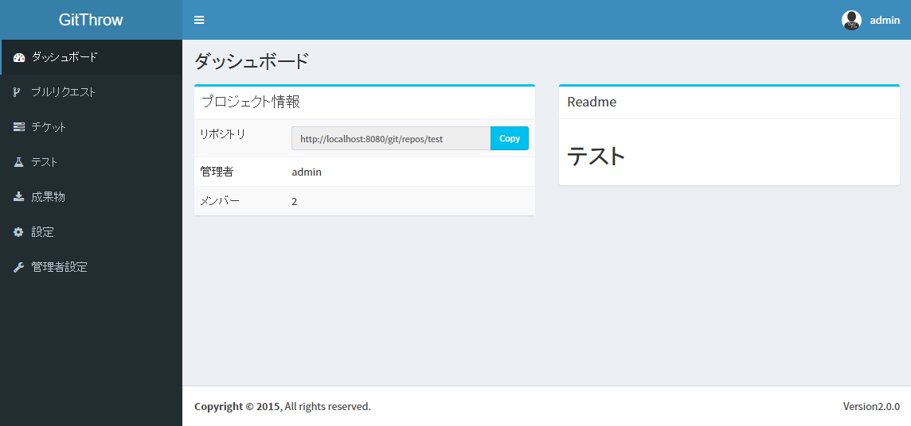
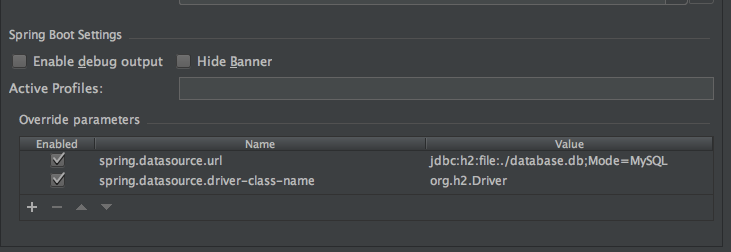

# Workbench2  
プロジェクトの管理を行うWebアプリです。  
簡単に自身のサーバーでホストできます。  

  

## 機能  
- Gitサーバー
- プロジェクトのタスク管理
- プルリクエスト
- プロジェクトのビルド
- プロジェクトのテスト
- 成果物の管理

## 使い方  
1. `java -jar Workbench.jar`を実行
1. http://localhost:8080/にアクセス
1. 管理者アカウントでログイン(id: admin, pw: password)

## 開発環境の整え方  
1. リポジトリをクローン
1. IntelliJなどでMavenプロジェクトとしてインポート
1. src/main/java/net/orekyuu/workbench/Workbench2Applicationを実行
  
ローカルにMySQLがある場合は開発用に実行構成をいじると便利です。  

